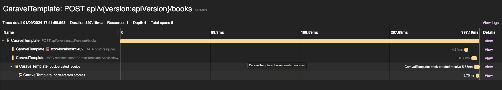

# Caravel Template

This template uses Caravel package as an SDK and it bootstraps a full functional web api following the Hexagonal Architecture:

* CaravelTemplate (Application Domain)
* CaravelTemplate.Application (Application business logic)
* CaravelTemplate.Adapter.MassTransit (Adapter to enable message queuing using MassTransit)
* CaravelTemplate.Adapter.Quartz (Adapter to enable scheduling jobs using Quartz)
* CaravelTemplate.Adapter.PostgreSql (Adapter to enable database assess queuing using Entity Framework and PostgreSql)
* CaravelTemplate.Adapter.Identity (Adapter to enable user management using ASP.NET Identity)
* CaravelTemplate.Adapter.API (HTTP API Server using ASP.NET 8.0)
* CaravelTemplate.Host (The program entry point that glues all the adapters and server)
* CaravelTemplate.Migrator (A slim program to handle entity framework migrations)


### Features

* [Caravel SDK](https://github.com/talento90/caravel) (Errors, Middleware, Exceptions)
* HTTP Api using Minimal APIs.
* Business logic using CQRS pattern + behaviours  ([MediatR](https://github.com/jbogard/MediatR))
* Message bus using ([MassTransit](https://github.com/MassTransit/MassTransit))
* Job Schedulers using ([Quartz](https://github.com/quartznet/quartznet))
* Observability + Dashboard using ([OpenTelemetry](https://github.com/open-telemetry/opentelemetry-dotnet)) and Aspire
* Entity Framework and Migrations using PostgreSQL
* Health Check mechanism
* OpenApi 3.0 Spec using [Swashbuckle](https://github.com/domaindrivendev/Swashbuckle)
* Docker and Docker Compose
* Logging using [Serilog](https://serilog.net/)
* Testing using [Bogus](https://github.com/bchavez/Bogus) (Fake data generator) + [Fluent Assertions](https://fluentassertions.com/) + [Test Containers](https://github.com/testcontainers/testcontainers-dotnet) + [Respawn](https://github.com/jbogard/Respawn) (Database Cleanup)


### Aspire Dashboard


## Installation

#### Download and Install Template
```bash
git clone git@github.com:Talento90/caravel-template.git
dotnet new --install ~/caravel-template
```

#### Generate Project
```bash
dotnet new caravel-webapi -n MyProject -o ./
```
Note: `MyProject` is  going to replace the `CaravelTemplate`  

#### Run Web Api

`dotnet run --project src/MyProject.WebApi`

`open http://localhost:5000/swagger/index.html`


## Docker Compose

- Setup PostgreSql container
- Setup RabbitMQ container
- Setup Aspire Dashboard container

```bash
# Setup and run docker compose
docker compose up

# Remove containers
docker compose down
```

## Entity Framework Migrations

* **[Official Documentation](https://learn.microsoft.com/en-us/ef/core/cli/dotnet)**
* Setup database from scratch: `sh scripts/database-init.sh`

```bash
# Install dotnet-ef tool
dotnet tool install --global dotnet-ef

# Update dotnet-ef tool
dotnet tool update --global dotnet-ef

# List all migrations
dotnet ef migrations list --startup-project src/CaravelTemplate.Migrator --project src/CaravelTemplate.Adapter.PostgreSql --context ApplicationDbContext --no-build

# Generate SQL Scripts
dotnet ef migrations script --startup-project src/CaravelTemplate.Migrator --project src/CaravelTemplate.Adapter.PostgreSql --context ApplicationDbContext --no-build 

# Add new database migration changes to the Application DbContext
dotnet ef migrations add CreateApplicationSchema --startup-project src/CaravelTemplate.Migrator --output-dir Migrations --project src/CaravelTemplate.Adapter.PostgreSql --context ApplicationDbContext --no-build
 
# Apply the migration changes
dotnet ef database update --startup-project src/CaravelTemplate.Migrator --project src/CaravelTemplate.Adapter.PostgreSql --context ApplicationDbContext --no-build   
```